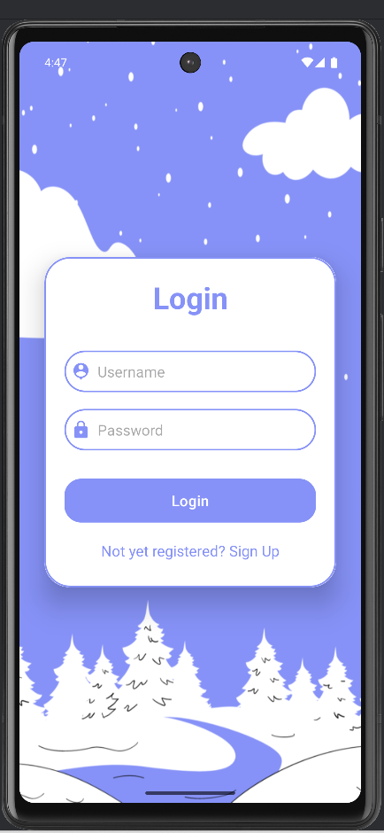
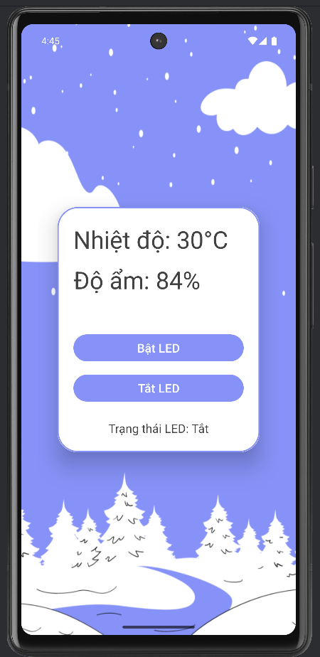

# IoT Project: Firebase & Sensor Integration

This project is an Internet of Things (IoT) application that integrates ESP32 sensors with Firebase, along with an Android app for monitoring and control.

---

## 📁 Folder Structure

- **App/**  
  Android application that serves as the user interface.  
  ➤ _"This is a demo application"_

- **ArduinoIDE/**  
  Source code for ESP32 microcontroller to connect to Firebase Realtime Database.  
  ➤ _"Connect ESP32 to Firebase"_

- **CamBien/**  
  Sensor control or visualization interface (possibly Node-RED or a desktop app).  
  ➤ _"Create app interface"_

---

## 🔌 Features

- 📡 Real-time sensor data sent to Firebase  
- 📱 Android interface to display/control sensor data  
- 🌐 Modular structure (ESP32, App, Interface separated)

---

## 📸 App Demo Screenshots

Here are some screenshots of the application:

  
  
  

## 🎥 Demo Video

> 📌 You can insert your app demo video below.

> Replace `VIDEO_ID_HERE` with the actual YouTube video ID.

---

## 🚀 How to Use

### 1. Arduino (ESP32)
- Open code in `ArduinoIDE/`
- Configure Firebase credentials
- Upload to ESP32

### 2. Android App
- Open project in Android Studio (`App/`)
- Build and run on your device

### 3. Sensor Interface (CamBien)
- Explore the interface code in `CamBien/`

---

## 🔧 Requirements

- ESP32 board  
- Android device  
- Firebase account  
- Arduino IDE  

---

## 📬 Contact

- 📱 Phone: 0389333814  
- 📧 Email: nguyenductongpro@gmail.com
